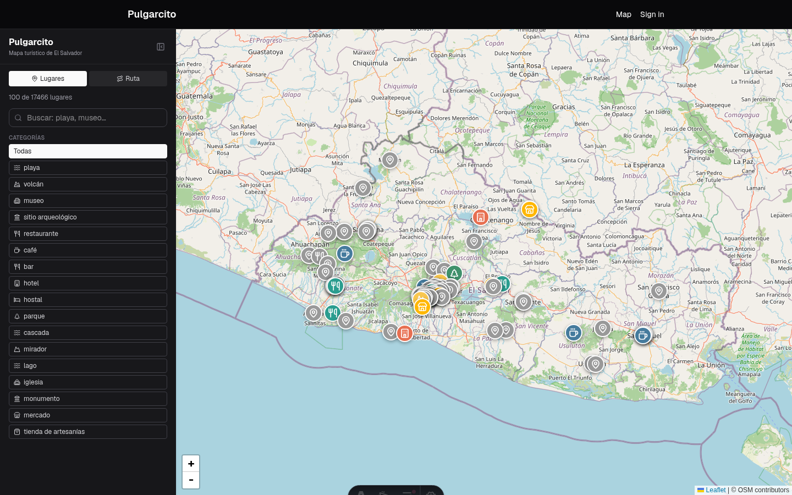
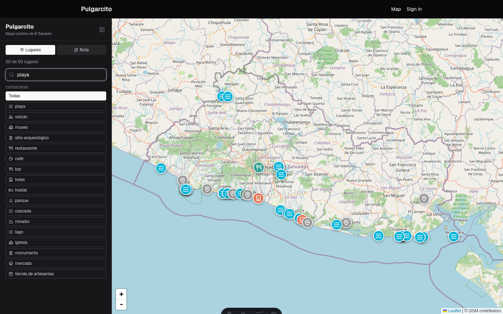
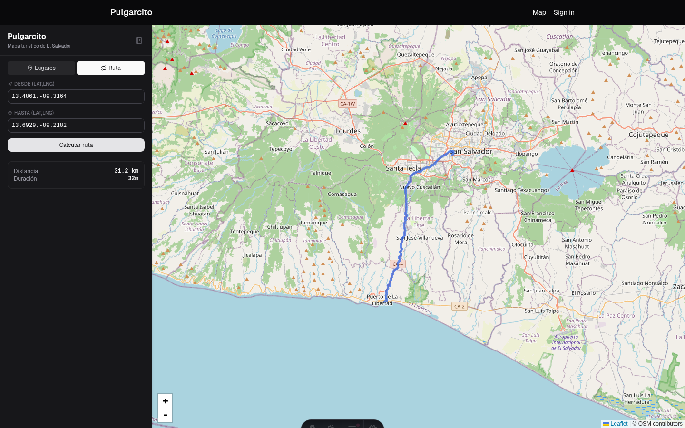

# Pulgarcito

A tourism map of El Salvador built on real OpenStreetMap data — pins for places, category filtering, fuzzy + semantic search, and turn-by-turn routing.

## What's here

| Folder | What it is |
| --- | --- |
| [`api/`](api/README.md) | Hono + Drizzle + Neon Postgres API. Serves places/search/route endpoints, better-auth for API keys, and the OSM ingest pipeline. |
| [`demo-web/`](demo-web/README.md) | Astro + React map UI. Talks to the API through a server-side proxy so the API key never reaches the browser. |

## Screenshots

**Search** — fuzzy + semantic hybrid search (`q=playa` below):

**Routing** — turn-by-turn distance/duration via OSRM:

## API routes (`api/`)

All `/api/v1/*` routes require an `X-API-Key` header from a valid, signed-up better-auth user.

| Method | Path | Description |
| --- | --- | --- |
| `GET` | `/healthz` | Liveness check. |
| `GET` | `/doc` | OpenAPI JSON document. |
| `GET` | `/docs` | Swagger UI. |
| `ALL` | `/api/auth/*` | better-auth — sign-up, sign-in, session, API key management. |
| `GET` | `/api/v1/places` | Paginated browse. Filters: `type`, `category`, `department`, `near` (`lat,lng`), `radius_km`, `limit`, `offset`. |
| `GET` | `/api/v1/places/search` | Fuzzy + semantic hybrid search (RRF-merged). Requires `q`; same filters as above; `limit` capped at 50 since it's ranked, not paginated. |
| `GET` | `/api/v1/places/{id}` | A single public, verified place. |
| `GET` | `/api/v1/route` | Proxies OSRM. Query: `from`, `to` (`lat,lng`), `profile` (`car`\|`foot`\|`bike`, default `car`). |

Ingest pipeline (`pnpm ingest:fetch` → `pnpm ingest:load` → `pnpm ingest:embed`) pulls places from OSM Overpass, derives `department`/`municipality` via point-in-polygon lookup against real admin boundaries, and backfills Mistral embeddings for search. These are manual commands, not something the running server or a deploy triggers — see [`api/README.md`](api/README.md#ingest-pipeline).

## Web routes (`demo-web/`)

| Path | Description |
| --- | --- |
| `/` | The map — pins, category filters, search, and the routing panel. |
| `/sign-in` | Sign up / sign in (better-auth), needed to create an API key. |
| `/dashboard` | Session info + API key management. |
| `/api/places` | Server-side proxy to the API's `/api/v1/places` (or `/search` when `q` is set). |
| `/api/route` | Server-side proxy to the API's `/api/v1/route`. |

## Running it

This is the `cloudflare` branch — deploy-only, not meant to be run interactively. For local development, switch to `master`: same app, `@astrojs/node` instead of the Cloudflare adapter, plain `pnpm dev` in each project, no Cloudflare-specific setup.

This branch deploys both projects to Cloudflare Workers instead. Each project's own README covers its deploy steps: [`api/README.md`](api/README.md#deploy), [`demo-web/README.md`](demo-web/README.md#deploy-cloudflare-workers).
